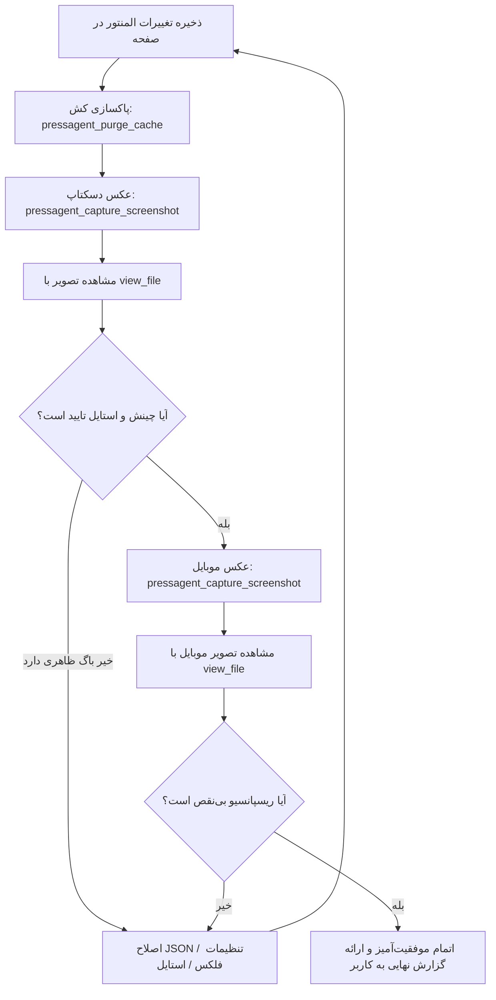

# Elementor Visual Inspector & Design QA

این اسکیل چرخه **بازخورد بصری (Visual Feedback Loop)** را در فرآیند طراحی و ویرایش صفحات پیاده‌سازی می‌کند تا ایجنت هوش مصنوعی هرگز چیدمان برگه را بدون دیدن تصویر خروجی رها نکند.

---

## چرا این اسکیل حیاتی است؟

وقتی هوش مصنوعی ساختار JSON یا کدهای المنتور را ذخیره می‌کند، خروجی به‌صورت انتزاعی ساخته شده است. عواملی مانند کش المنتور، ویژگی‌های ارث‌بری CSS قالب، شکست متن‌ها و اندازه‌های درصدی ممکن است باعث شوند ظاهر واقعی با آنچه در ذهن مدل بوده تفاوت داشته باشد. این اسکیل با تصویربرداری مستقیم از مرورگر، چشم بصری مدل را فعال می‌کند.

---

## چرخه بازرسی ۵ مرحله‌ای (۵-Step Visual Loop)



---

## دستورالعمل اجرایی برای ایجنت

### ۱. پس از اعمال هر ویرایش:
بلافاصله بعد از صدا زدن `pressagent_update_widget` یا `pressagent_add_elementor_section`:
1. کش را پاک کنید:
   ```json
   pressagent_purge_cache({ "plugin_slug": "all" })
   ```
2. اسکرین‌شات دسکتاپ بگیرید:
   ```json
   pressagent_capture_screenshot({
     "page_id": <PAGE_ID>,
     "viewport": "desktop",
     "wait_ms": 2500
   })
   ```

### ۲. مشاهده و تحلیل دقیق با `view_file`:
ابزار `view_file` را روی مقدار `image_path` برگشتی فراخوانی کنید:
```text
view_file({ "AbsolutePath": "/tmp/pressagent_desktop_xxx.png" })
```
تصویر لود شده در کانتکست چندوجهی (Multimodal) مدل نمایش داده می‌شود.

### ۳. چک‌لیست بازرسی چشمی (Eye Inspection Checklist):
- [ ] **چینش افقی در برابر عمودی:** آیا کارت‌ها، فیلترها و دکمه‌ها به‌جای ستون شدن، در ردیف‌های منظم افقی قرار گرفته‌اند؟
- [ ] **جهت متن (RTL):** آیا چیدمان زبان فارسی از راست به چپ رعایت شده و آیکون‌ها و لوگو سمت درست قرار دارند؟
- [ ] **عدم همپوشانی (No Overlaps):** آیا متنی روی تصویر یا منو روی محتوای دیگر نیفتاده است؟
- [ ] **خوانایی و کنتراست رنگ:** آیا فونت‌ها خوانا، سایزها هماهنگ و رنگ دکمه‌ها برجسته است؟

### ۴. بررسی اجباری نمای موبایل:
```json
pressagent_capture_screenshot({
  "page_id": <PAGE_ID>,
  "viewport": "mobile",
  "wait_ms": 2500
})
```
مجدداً با `view_file` فایل تصویر موبایل را ببینید:
- آیا منوی موبایل سالم است؟
- آیا دکمه‌ها اندازه مناسبی برای لمس با انگشت دارند؟
- آیا اسکرول افقی ناخواسته (Horizontal Overflow) ایجاد نشده است؟

### ۵. اصلاح خودکار تا رسیدن به نتیجه مطلوب:
اگر هر مشکلی در تصویر مشاهده کردید، **منتظر گلایه کاربر نمانید.** خودتان فیلدها و استایل‌های المنتور را اصلاح کنید، مجدد اسکرین‌شات بگیرید و پس از اطمینان کامل از زیبایی خروجی، نتیجه را گزارش دهید.
