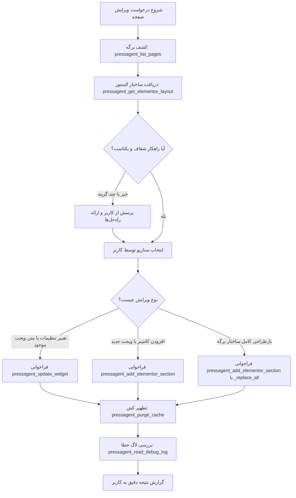

# PressAgent Elementor Page Builder Skill

این اسکیل نحوه مدیریت و ویرایش حرفه‌ای برگه‌های وردپرس با ویرایشگر **المنتور (Elementor)** را با استفاده از جعبه‌ابزار **PressAgent MCP** تعریف می‌کند.

---

## ۱. اصول اساسی و خط‌قرمزها (Core Principles)

1. **ویرایش منحصراً از طریق المان‌های المنتور (Elementor-Native Only):**
   - به هیچ عنوان محتوای برگه را از طریق `post_content` خام، HTML دست‌نویس یا ویرایش مستقیم متای دیتابیس بدون فراخوانی مسیر ذخیره المنتور تغییر ندهید.
   - تمام متون، دکمه‌ها، تصاویر، استایل‌ها و ساختاربندی‌ها باید در قالب گره‌های المنتور (`elType`: `container`, `section`, `column`, `widget`) تعریف شوند.

2. **قاعده پرسش و مشورت با کاربر (Interactive Decision Gate):**
   - **هر زمان که بیش از یک راهکار پیاده‌سازی وجود داشت** (مثلاً: ادیت درون‌خطی ویجت موجود در برابر ساخت یک سکشن/کانتینر مدرن جدید؛ یا انتخاب میان چند طرح UI/UX مختلف)، **حتماً قبل از اعمال، سناریوها را با کاربر مطرح کنید.**
   - اگر ابزار یا ویجت خاصی (مثل ویجت‌های Elementor Pro یا افزونه‌های متفرقه مانند JetElements) در دسترس نبود یا درخواست کاربر با ساختار فعلی المنتور به طور مستقیم سازگار نبود، مراتب را صریحاً توضیح داده و راهکارهای جایگزین را به کاربر پیشنهاد دهید.

3. **پایبندی به استانداردهای هسته وردپرس و سئو:**
   - **سلسله‌مراتب تیترها:** رعایت یک تگ `h1` معنایی در صفحه، و استفاده منظم از `h2`، `h3` و... برای زیرعنوان‌ها.
   - **دسترسی‌پذیری و استانداردهای وب:** پر کردن صحیح فیلدهای `alt` برای تصاویر، تعبیه لینک‌های استاندارد و رعایت تضاد رنگ و کنتراست.
   - **تطهیر داده‌ها (Data Sanitization):** ورودی‌های متنی و اسکریپتی باید تمیز و استاندارد باشند.

4. **ایمنی نسبت به کش و پایداری (Cache-Safe & Action Guard):**
   - سرور PressAgent تمام ویرایش‌ها را از مسیر رسمی `$document->save()` المنتور ثبت می‌کند و به طور خودکار اسنپ‌شات برگشت‌پذیر (Snapshot) تهیه می‌نماید.
   - پس از هر ویرایش ساختاری، وضعیت سلامت لاگ را با `pressagent_read_debug_log` بررسی نموده و در صورت لزوم کش سایت را با `pressagent_purge_cache` پاک کنید.

---

## ۲. گردش‌کار گام‌به‌گام (Step-by-Step Workflow)



---

### گام ۱: شناسایی برگه (Discovery)
- اگر `page_id` در پرامپت مشخص نیست، ابزار `pressagent_list_pages` را فراخوانی کنید.
- بررسی کنید آیا `elementor_enabled` برای آن صفحه `true` است یا خیر.
- اگر صفحه وجود ندارد و کاربر قصد ساخت صفحه نو دارد:
  ```json
  pressagent_create_page({
    "title": "عنوان برگه",
    "status": "publish",
    "elementor_enabled": true
  })
  ```

### گام ۲: تحلیل درخت المنتور (Layout Inspection)
- فراخوانی `pressagent_get_elementor_layout({ "page_id": <ID> })`.
- خروجی را بررسی کنید:
  - شناسه‌های یکتای ویجت‌ها (`id`)
  - نوع ویجت‌ها (`widgetType`: `"heading"`, `"text-editor"`, `"button"`, ...)
  - تنظیمات فعلی (`settings`)
  - ساختار دربرگیرنده (`container` در المنتور نسخه‌های جدید Flexbox، یا `section` / `column` در نسخه‌های سنتی).

### گام ۳: گیت تصمیم‌گیری و سوال از کاربر
در این موارد **توقف کرده و با کاربر مشورت کنید**:
- اگر چند سبک چیدمان (Layout) برای درخواست وجود دارد (مثلاً چیدمان ۲ ستونه در برابر ۳ ستونه، یا کارت‌های آیکونی در برابر متن ساده).
- اگر ویرایش خواسته شده ممکن است بخش‌های دیگر صفحه را تحت تاثیر قرار دهد.
- اگر کاربر نام المانی برده که در قالب یا المنتور پایه تعریف نشده است.

### گام ۴: اعمال ویرایش از طریق ابزارهای MCP

#### حالت الف: ویرایش ویجت موجود
اگر شناسه ویجت هدف مشخص است، فقط تنظیمات نیاز به ویرایش را ارسال کنید:
```json
pressagent_update_widget({
  "page_id": 12,
  "widget_id": "abc1234",
  "settings": {
    "title": "تیتر جدید سئو شده",
    "header_size": "h2",
    "align": "right"
  }
})
```

#### حالت ب: الحاق سکشن/کانتینر جدید به برگه
کانتینر جدید همراه با ویجت‌های داخلی و شناسه‌های یکتا (`id`) را به انتهای برگه الحاق کنید:
```json
pressagent_add_elementor_section({
  "page_id": 12,
  "section_data": {
    "id": "c_9a8b7c",
    "elType": "container",
    "settings": {
      "content_width": "boxed",
      "flex_direction": "column"
    },
    "elements": [
      {
        "id": "w_5d4e3f",
        "elType": "widget",
        "widgetType": "heading",
        "settings": {
          "title": "ویژگی‌های برتر ما",
          "header_size": "h2",
          "align": "center"
        },
        "elements": []
      }
    ]
  }
})
```

#### حالت ج: بازطراحی یا جابجایی ساختار کامل صفحه (`_replace_all`)
اگر نیاز به حذف، جابجایی ترتیب سکشن‌ها یا بازچینی کامل صفحه دارید:
```json
pressagent_add_elementor_section({
  "page_id": 12,
  "section_data": {
    "_replace_all": true,
    "elements": [
      /* آرایه کامل سکشن‌ها و کانتینرهای صفحه */
    ]
  }
})
```

### گام ۵: پاکسازی کش و بررسی پایداری
1. در صورت فعال بودن افزونه‌های کشینگ، `pressagent_purge_cache({ "plugin_slug": "all" })` را فراخوانی نمایید.
2. با ابزار `pressagent_read_debug_log({ "lines": 20, "level": "error" })` مطمئن شوید بعد از ذخیره‌سازی هیچ Fatal Error یا خطای PHP ثبت نشده است.

### گام ۶: بازرسی بصری اجباری (Visual Verification Loop)
> [!IMPORTANT]
> هرگز کار را بدون دیدن اسکرین‌شات خروجی تمام‌شده تلقی نکنید! برای جلوگیری از انباشتگی عمودی ناخواسته المان‌ها یا به‌هم‌ریختگی ظاهری، حتماً خروجی را بررسی بصری کنید:
1. گرفتن اسکرین‌شات دسکتاپ:
   ```json
   pressagent_capture_screenshot({ "page_id": 12, "viewport": "desktop" })
   ```
2. مشاهده و بررسی تصویر با ابزار `view_file` روی مسیر فایل برگشتی (مثلاً `/tmp/pressagent_preview_desktop.png`).
3. گرفتن اسکرین‌شات موبایل برای بررسی ریسپانسیو:
   ```json
   pressagent_capture_screenshot({ "page_id": 12, "viewport": "mobile" })
   ```
4. مشاهده تصویر موبایل با `view_file`.
5. **چک‌لیست تطبیق بصری:**
   - آیا کارت‌ها به صورت افقی قرار گرفته‌اند یا ستونی شده‌اند؟
   - آیا فاصله‌ها و پدینگ‌ها هماهنگ هستند؟
   - آیا متن‌ها درست شکسته‌اند و المانی بریده نشده است؟
   - در صورت مشاهده هر باگ، تنظیمات المنتور یا CSS را اصلاح کرده و مجدداً اسکرین‌شات بگیرید تا تایید شود.

---

## ۳. منابع و مستندات تکمیلی

جهت دسترسی به اسکیماها و جزئیات فنی ابزارها، فایل‌های زیر را مطالعه نمایید:
- [راهنمای جامع ابزارهای MCP](./references/mcp-tools-reference.md)
- [الگوها و اسکیمای JSON المان‌های المنتور](./references/elementor-widget-schemas.md)
- [استانداردهای کدنویسی وردپرس، سئو و دسترسی‌پذیری](./references/wordpress-standards.md)
